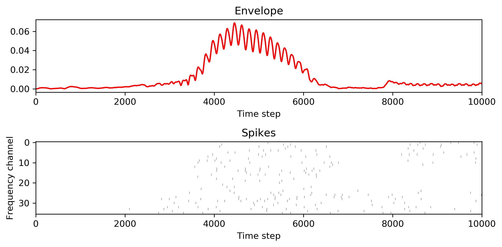
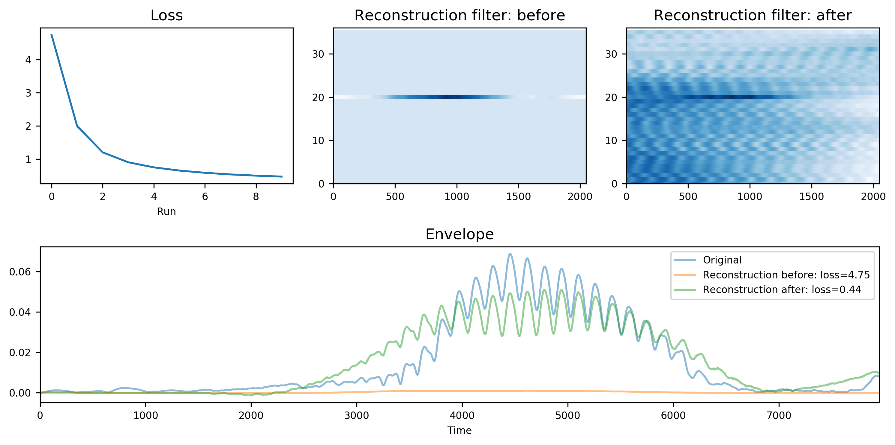

# 2dReconstruction
User-friendly code for training 2d reconstruction filters.

**Applications**
* Reconstruct a signal from multi-channel neural spikes
* Impute missing data from multiple signals

## Example
Reconstruct a one-dimensional signal envelope from 36-frequency-channel neural spikes.

*Run Example.ipynb for a quick demo.*
### Inputs


After running 10 epochs of gradient descent to find optimal 2d reconstruction filter.
### Results


## Requirements
This package has the following requirements:

* ```python 3.7```
* ```pytorch 1.0.0```


## Author
This project was part of the PhD dissertation by **Junzi Dong**. Defended on December 13, 2016.


## References
Please cite the following paper if you find the code useful in your research:
link to paper

## License
This project is licensed under the MIT License - see the [LICENSE.md](LICENSE.md) file for details
